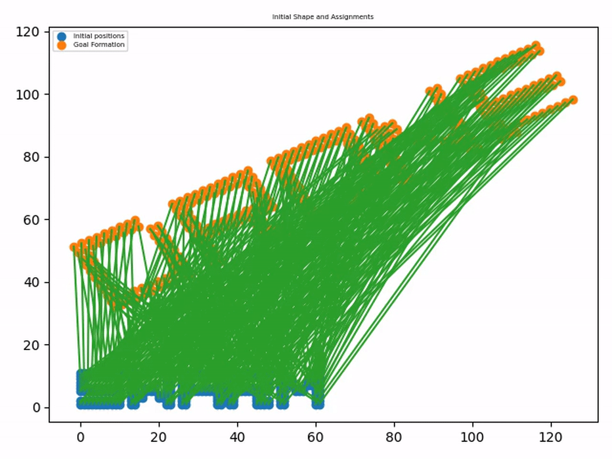

Implementation of "Simultaneous Optimization of Assignments and Goal Formations for Multiple Robots" and a variant of the approach to handle variable rotations of the formation.

Checkout the [Blog Post](https://www.itskalvik.com/research/blog/soagf/)

## Reference
[Agarwal, Saurav, and Srinivas Akella. "Simultaneous optimization of assignments and goal formations for multiple robots." 2018 IEEE International Conference on Robotics and Automation (ICRA). IEEE, 2018](https://ieeexplore.ieee.org/abstract/document/8460542). 
